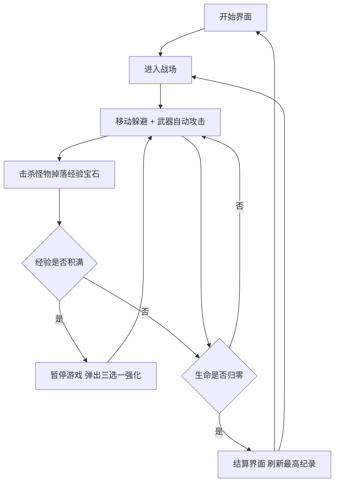

# 夜裔幸存者（Night Survivors）— 产品需求文档

## 1. 产品概述
一款类《吸血鬼幸存者》的单页 2D 俯视角生存动作游戏：玩家操控角色在无限卷动的暗黑原野上移动，武器自动攻击，抵御从四面八方涌来的怪物潮，拾取经验宝石不断升级、构筑技能，尽可能活得更久。
- 目标用户：休闲/roguelike 玩家，打开浏览器即可游玩，无需注册与安装
- 产品价值：单局 5~15 分钟的强节奏"Build 构筑 + 弹幕生存"体验，易上手、难精通

## 2. 核心功能

### 2.1 用户角色
无需注册登录，所有玩家均为同一角色：玩家（本地单机游玩，最高纪录存储于浏览器 localStorage）。

### 2.2 功能模块
1. **开始界面**：游戏标题、美术氛围图、开始按钮、操作说明、历史最高纪录展示
2. **游戏主界面（核心）**：
   - 无限卷动地图与相机跟随
   - 玩家移动（WASD / 方向键）
   - 武器自动攻击系统（多武器可叠加）
   - 敌人潮生成系统（随时间增强、多波次多种类）
   - 经验宝石掉落与拾取（磁吸范围）
   - 升级三选一强化（武器解锁/升级 + 被动属性）
   - HUD：血条、经验条、计时、击杀数、等级
3. **结算界面**：存活时间、击杀数、等级、最高纪录对比、重新开始

### 2.3 页面详情
| 页面名称 | 模块名称 | 功能描述 |
|----------|----------|----------|
| 开始界面 | 标题区 | 像素风游戏 LOGO + 火焰粒子氛围动效 |
| 开始界面 | 开始按钮 | 点击进入战斗，悬停有辉光动效 |
| 开始界面 | 操作说明 | WASD 移动、武器自动攻击、拾取宝石升级的图文说明 |
| 开始界面 | 最高纪录 | 读取 localStorage 展示历史最佳存活时间与击杀数 |
| 游戏主界面 | 游戏画布 | Canvas 2D 渲染：地面平铺、角色、敌人、弹幕、掉落物、伤害飘字 |
| 游戏主界面 | 相机系统 | 以玩家为中心平滑跟随，敌人从视野边缘外刷出 |
| 游戏主界面 | 武器系统 | 初始武器"血之飞刃"，自动索敌攻击；可解锁圣水（范围灼烧）、回旋斧（穿透回旋）、闪电链（随机落雷） |
| 游戏主界面 | 敌人系统 | 蝙蝠（快而脆）、骷髅（均衡）、巨型史莱姆（慢而肉）；随分钟数提升血量/速度/数量，定时刷新精英怪 |
| 游戏主界面 | 掉落系统 | 敌人死亡掉落经验宝石（小/中/大），进入磁吸范围自动飞向玩家 |
| 游戏主界面 | 升级系统 | 经验满即暂停弹窗，随机 3 个强化选项（新武器/武器升级/移速/最大生命/伤害/磁吸范围），选完继续 |
| 游戏主界面 | HUD | 顶部经验条与等级、中央计时器、击杀数、左下血条、已获得武器/被动图标栏 |
| 游戏主界面 | 受击反馈 | 玩家受击红屏闪烁 + 屏幕震动；敌人受击闪白 + 击退 |
| 结算界面 | 战绩面板 | 本局存活时间、击杀数、等级，与最高纪录对比（破纪录高亮） |
| 结算界面 | 重新开始 | 一键重开新一局，也可返回开始界面 |

## 3. 核心流程
玩家打开页面 → 开始界面点击"开始狩猎" → 进入战场：移动躲避怪物、武器自动攻击 → 击杀怪物掉落经验宝石 → 拾取宝石积满经验 → 暂停弹出三选一强化 → 构筑成型后怪物潮同步增强 → 循环直至生命归零 → 结算界面展示战绩并刷新最高纪录 → 可立即重开。

## 4. 用户界面设计

### 4.1 设计风格
- **整体风格**：暗黑哥特 + 复古像素风（Dark Gothic Pixel Art），致敬《吸血鬼幸存者》的街机质感
- **主色**：深渊黑紫 `#0d0a1a`（背景）、血色猩红 `#c0392b` / `#e74c3c`（主强调）、幽绿 `#2ecc71`（经验宝石）
- **辅助色**：骨白 `#e8e0d0`（文字）、暗金 `#d4af37`（升级/稀有元素）、魔紫 `#8e44ad`（精英怪/稀有掉落）
- **按钮样式**：像素描边 + 斜切角的哥特按钮，悬停时血色辉光扩散，点击有下压反馈
- **字体**：标题使用像素字体 "Press Start 2P"，正文使用衬线哥特风 "IM Fell English"（中文回退为思源宋体），HUD 数字使用等宽像素数字
- **布局**：全屏画布居中，HUD 元素贴边悬浮，所有 UI 面板为暗色半透明 + 像素边框
- **图标**：武器/被动图标使用 AI 生成的 32×32 像素图标

### 4.2 页面设计概览
| 页面名称 | 模块名称 | UI 元素 |
|----------|----------|---------|
| 开始界面 | 标题区 | 大号像素标题，猩红渐变 + 滴血装饰，蝙蝠粒子环绕动画 |
| 开始界面 | 按钮区 | 居中纵向排列，像素描边按钮，悬停辉光 + 音效震动感 |
| 游戏主界面 | HUD | 顶部通栏经验条（幽绿发光）、中央大号像素计时器、左上血条（猩红渐变）、左下武器图标栏 |
| 游戏主界面 | 升级弹窗 | 全屏暗化遮罩 + 三张纵向卡牌（暗金描边），悬停卡牌上浮放大，选中时金光爆闪 |
| 结算界面 | 战绩面板 | 居中面板，"你倒在了黎明前"文案，数据逐行打字机出现，破纪录时金色"NEW RECORD"闪烁 |

### 4.3 响应式
桌面优先（键鼠操作），画布自适应窗口缩放并保持像素渲染（image-rendering: pixelated）；移动端做基础适配（虚拟摇杆移动），但不作为重点。
