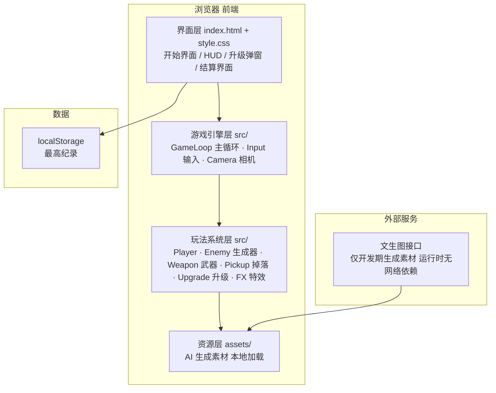
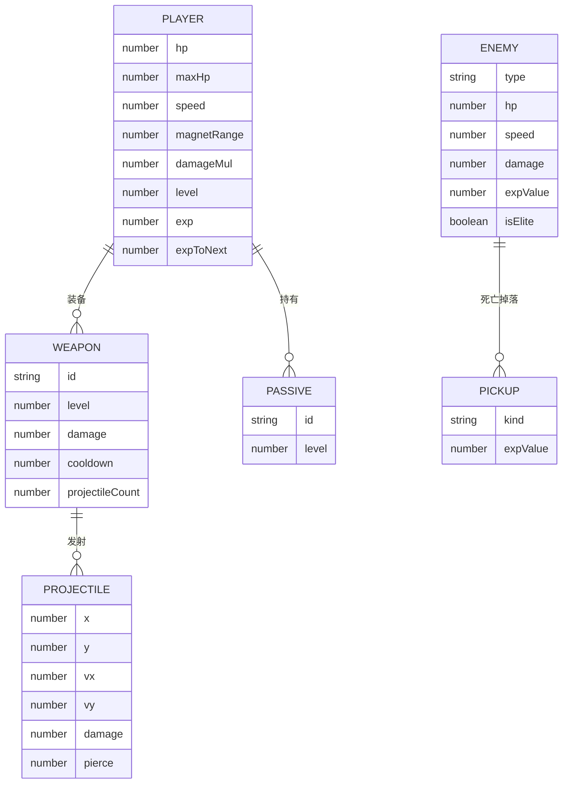

# 夜裔幸存者（Night Survivors）— 技术架构文档

## 1. 架构设计
纯前端单机游戏，无后端、无数据库。素材图通过文生图接口生成后下载为本地静态资源。

## 2. 技术描述
- 前端：Vite@5 + 原生 JavaScript（ES Modules）+ Canvas 2D（选择说明：游戏为逐帧 Canvas 渲染，引入 React 无收益且增加包体积；UI 层用 DOM 覆盖层实现）
- 初始化工具：npm create vite@latest（vanilla 模板）
- 后端：无
- 数据库：无；最高纪录使用 localStorage 持久化
- 素材来源：开发期通过文生图接口生成（像素风、透明感底色的角色/敌人/图标/地面），下载至 `public/assets/`，运行时全部本地加载
- 渲染：Canvas 2D + `image-rendering: pixelated`，逻辑分辨率 960×540 按窗口等比放大，保证像素不模糊
- 游戏循环：`requestAnimationFrame` + 固定步长（60Hz 逻辑、可变渲染），deltaTime 驱动移动与冷却
- 性能策略：对象池复用敌人/弹幕/飘字，空间哈希网格做碰撞检测，目标 500+ 同屏敌人稳定 60fps

## 3. 路由定义
| 路由 | 用途 |
|------|------|
| / | 单页游戏（开始界面、战场、结算均为页内状态切换，无多路由） |

## 4. API 定义
无后端 API。开发期素材生成接口（仅用于产出静态图片文件，产物入库到项目内）：
- `GET https://trae-api-cn.mchost.guru/api/ide/v1/text_to_image?prompt={prompt}&image_size={size}`
- 生成清单：主角、蝙蝠、骷髅、史莱姆、精英怪、4 种武器图标、经验宝石（小/中/大）、地面纹理、开始界面背景图

## 5. 服务器架构图
无后端，不适用。

## 6. 数据模型
无数据库。核心游戏实体（内存态）结构如下：

localStorage 键值设计：`night_survivors_best = { "time": 秒数, "kills": 数量, "level": 等级 }`
